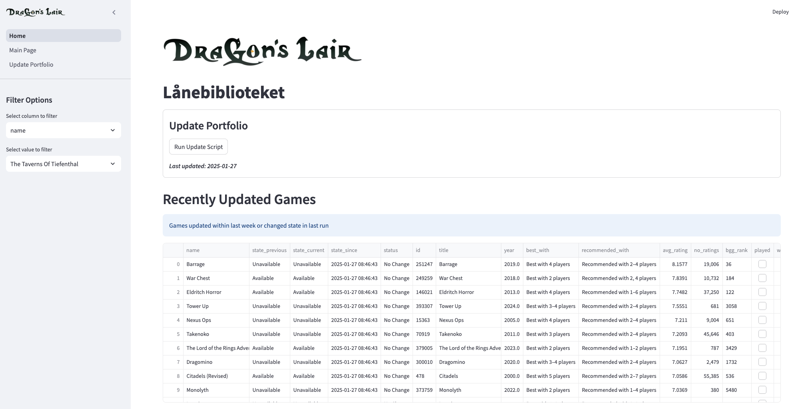

# Dragon-Scrape

Dragon-Scrape is a Python project for scraping and tracking board game availability from the "Lånebiblioteket" section of Dragonslair's website. It fetches game data, cleans it, and identifies changes in availability between runs.

## Features

- **Web Scraping**: Fetches game data from the Dragon's Lair website.
- **Data Cleaning**: Processes and cleans game names and availability status.
- **Data Enrichment**: Integrates with the BoardGameGeek API to fetch additional game details.
- **API Rates**: Handles API rate limits and retries.
- **Streamlit Application**: Run the script and analyze the output with a Streamlit application.

## Requirements

- Python 3.8 or higher
- Required libraries:
  - `beautifulsoup4`
  - `requests`
  - `json`
  - `pandas`
  - `lxml`
  - `datetime`
  - `logging`
  - `os`
  - `streamlit`

  ## Project Structure
The project is organized as follows:
```plaintext
dragon-scrape/
    ├── assets/
    ├── example_output/
    ├── output/
    ├── streamlit/
    ├── .gitignore
    ├── bgg_api.py
    ├── dragon_scrape.py
    ├── main.py
    ├── README.md
```

## How It Works
### Scraping Pages:

The script fetches game data page by page from the Dragonslair website, using requests to retrieve HTML content and BeautifulSoup to parse it.

### Parsing Game Data:

Extracts game names and availability status from the website’s HTML structure.

### Cleaning Data:

Removes invalid entries and standardizes the availability status (Available, Unavailable).

### Tracking Changes:

Compares the current scrape with the previous run, tracking changes in game availability and identifying new games.

### Enriching Data with BGG API:

1. **Fetching Game IDs**: The script calls the BGG API to fetch game IDs for new or unfetched games.
2. **Fetching Game Details**: Once the game IDs are obtained, the script fetches additional details such as title, year, average rating, number of ratings, and BGG rank.
3. **Handling Rate Limits**: The script includes logic to handle API rate limits by implementing retries with exponential backoff.

### Streamlit App

Visualizes the output in a Streamlit App where you can enrich the output with games you've played or wish to play. You can filter and break down the results and deep-dive into the library to find your next game.


### Key Files and Directories
- `bgg_api.py`: Contains functions to interact with the BoardGameGeek API.
- `dragon_scrape.py`: Contains functions to scrape the Dragon's Lair website.
- `main.py`: The main entry point of the application.
- `example_output/`: Directory containing example output files.
- `streamlit/`: Directory containing Streamlit app files.
- `assets/`: Directory containing assets used in the project.
- `.gitignore`: Specifies files and directories to be ignored by Git.

### How To Use the Tool

#### Setup
1. Clone the repository:
```shell
git clone <repository-url>
cd dragon-scrape
```

2. Install the necessary dependencies
```shell
pip install -r requirements.txt
```

#### Running the Scraper
1. Start the scraping process:
```shell 
python main.py
```
2. The scraper will fetch game data from the Dragon's Lair website and save the output files in the output/ directory.

#### Running the Streamlit App
1. Navigate to the streamlit directory:
```shell
cd streamlit
```
2. Run the Streamlit app:
```shell
streamlit run Home.py
```
3. Open the provided URL in your web browser to interact with the app.


### Example Output
  
`final_data.csv`:

| title                | id          | year | best_with | recommended_with | avg_rating | no_ratings | bgg_rank | state_current | state_previous | state_since          | status       |
|----------------------|-------------|------|-----------|------------------|------------|------------|----------|---------------|----------------|----------------------|--------------|
| Catan                | 13          | 1995 | 4         | 3                | 7.2        | 100000     | 1        | Available     | Unavailable    | 2023-10-01 12:00:00  | State Change |
| Pandemic             | 14          | 2008 | 4         | 4                | 7.6        | 80000      | 2        | Available     | Available      | 2023-10-01 12:00:00  | No Change    |
| Terraforming Mars    | 15          | 2016 | 5         | 4                | 8.4        | 60000      | 3        | Unavailable   | Available      | 2023-10-01 12:00:00  | State Change |

Streamlit Application Example:
